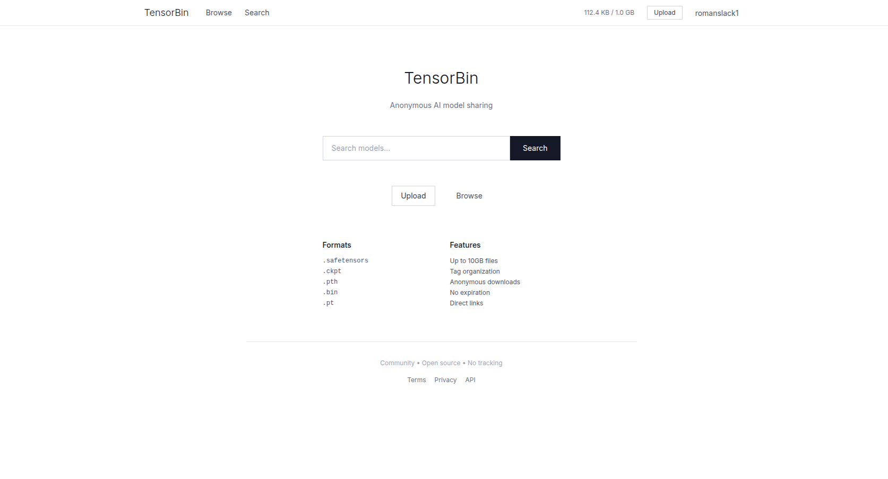
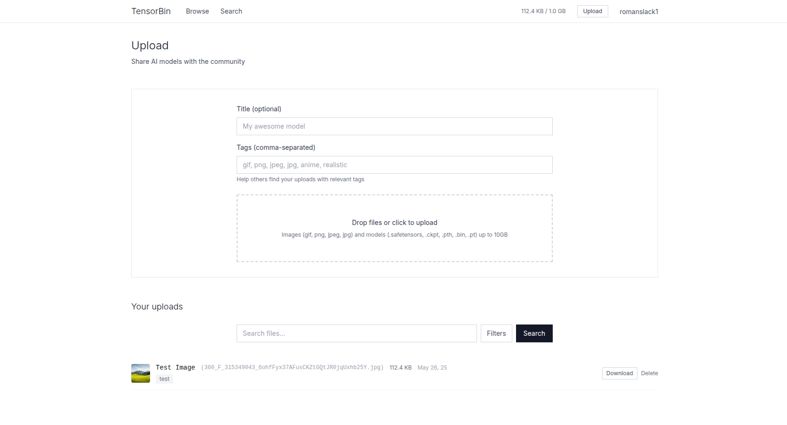

# TensorBin

[](https://opensource.org/licenses/MIT)
[](https://www.python.org/)
[](https://fastapi.tiangolo.com/)
[](https://nextjs.org/)
[](https://www.postgresql.org/)
[](https://redis.io/)

> **A barebones, self-hosted alternative to CivitAI for sharing AI models and assets**



## 🎯 What is TensorBin?

TensorBin is a **simple, clean, and lightweight** file sharing platform designed specifically for AI practitioners. While CivitAI offers extensive community features, TensorBin focuses on the essentials: **fast uploads, organized storage, and easy sharing** of AI models, datasets, and related files.

### Why TensorBin over CivitAI?

- **🏠 Self-hosted**: Full control over your data and infrastructure
- **⚡ Lightweight**: No bloat, just the features you need
- **🔒 Private**: Perfect for teams, research groups, or personal use
- **🎨 Clean UI**: Minimalist design focused on functionality
- **📱 Modern**: Built with contemporary web technologies



## ✨ Features

- **📁 Smart File Management**: Upload and organize AI models (.safetensors, .ckpt, .pth), images, and datasets
- **🏷️ Tag System**: Categorize files with custom tags for easy discovery
- **🖼️ Image Thumbnails**: Automatic thumbnail generation for visual files
- **📊 File Details**: Complete metadata including size, type, SHA256, and download counts
- **🔍 Search & Filter**: Find files quickly by name, tags, or file type
- **👥 Multi-user**: User accounts with individual storage quotas
- **📱 Responsive**: Works seamlessly on desktop and mobile
- **🔐 Secure**: JWT authentication with proper file access controls

## 🛠️ Tech Stack

- **Backend**: FastAPI + PostgreSQL + Redis + Celery
- **Frontend**: Next.js 14 + TypeScript + Tailwind CSS
- **Authentication**: JWT with refresh tokens
- **File Storage**: Local filesystem with SHA256 deduplication
- **Image Processing**: Pillow for thumbnail generation

## 🚀 Quick Start

### Prerequisites
- Python 3.12+
- Node.js 18+
- PostgreSQL 15+
- Redis 7+

### 1. Clone the Repository
```bash
git clone https://github.com/yourusername/tensorbin.git
cd tensorbin
```

### 2. Backend Setup
```bash
cd backend

# Install dependencies
pip install -r requirements.txt

# Start PostgreSQL and Redis (using Docker)
cd postgres_redis_docker
docker compose up -d

# Set up database
psql -h localhost -p 5433 -U tensorbin -d tensorbin
# Run SQL commands from documents/manual_database_setup.sql

# Start backend server
cd ..
uvicorn app.main:app --host 0.0.0.0 --port 8000 --reload
```

### 3. Frontend Setup
```bash
cd frontend

# Install dependencies
npm install

# Start development server
npm run dev
```

### 4. Access TensorBin
- **Frontend**: http://localhost:3000
- **Backend API**: http://localhost:8000
- **API Docs**: http://localhost:8000/docs

## 📖 Usage

1. **Register**: Create an account at `/auth/register`
2. **Upload**: Drag & drop files or click to upload
3. **Organize**: Add titles and tags to your uploads
4. **Share**: Files are accessible to all registered users
5. **Manage**: View, download, or delete your files from the dashboard

## 🏗️ Project Structure

```
tensorbin/
├── backend/           # FastAPI backend
│   ├── app/          # Application code
│   ├── uploads/      # File storage
│   └── requirements.txt
├── frontend/         # Next.js frontend
│   ├── app/         # Pages and layouts
│   ├── components/  # Reusable components
│   └── utils/       # API utilities
└── documents/       # Setup documentation
```

## 🔧 Configuration

### Database Ports (if using Docker)
- PostgreSQL: `localhost:5433`
- Redis: `localhost:6380`

### Environment Variables
Backend configuration is handled in `backend/app/config.py` with sensible defaults for development.

## 📝 License

This project is licensed under the MIT License - see the [LICENSE](LICENSE) file for details.

## 🤝 Contributing

Contributions are welcome! Please feel free to submit a Pull Request.

---

**TensorBin** - Simple, fast, self-hosted AI model sharing ⚡